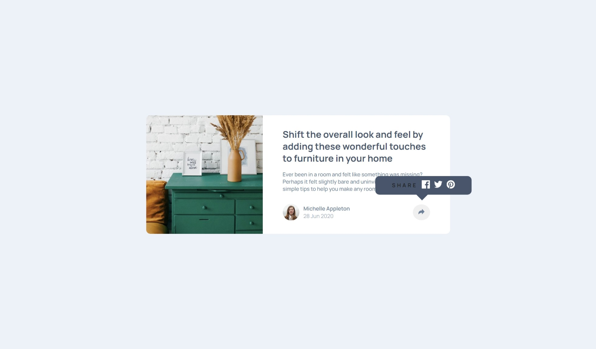

# Frontend Mentor - Article preview component solution

This is a solution to the [Article preview component challenge on Frontend Mentor](https://www.frontendmentor.io/challenges/article-preview-component-dYBN_pYFT). Frontend Mentor challenges help you improve your coding skills by building realistic projects. 

## Table of contents

- [Overview](#overview)
  - [The challenge](#the-challenge)
  - [Screenshot](#screenshot)
  - [What I learned](#what-i-learned)

## Overview

### The challenge

Users should be able to:

- View the optimal layout for the component depending on their device's screen size
- See the social media share links when they click the share icon

### Screenshot

### Built with

- Semantic HTML5 markup
- CSS custom properties
- Flexbox
- CSS Grid
- Mobile workflow
- [Styled Components](https://styled-components.com/) - For styles

### What I learned

What a useful project I learnt so many important aspects and i reinforced my knowledge on so many areas like:
- CSS Variables: Using :root to define reusable values, making your CSS more maintainable.

- Flexbox and Grid: Using these layout models for creating flexible and responsive layouts.

- Transform Property: Understanding how transform works to move, scale, rotate, and skew elements.

- Hover Effects: Enhancing user interaction with smooth transitions and hover effects.

- Positioning: Utilizing position: absolute and relative for precise placement of elements.

- Media Queries: Making designs responsive to different screen sizes.

- Event Handling: Using JavaScript to add interactivity, like toggling elements on click.

##### there's always more to learn

